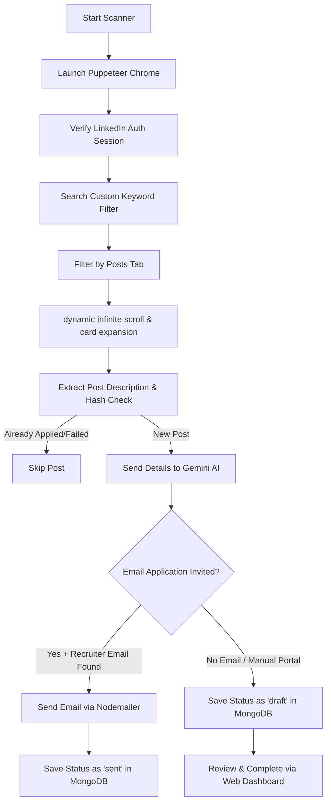

# 🦁 AutoJob: LinkedIn Outreach & Apply Automation

AutoJob is an intelligent, automated job application and recruiter outreach assistant built using **Node.js, Puppeteer, Express, MongoDB, and the Gemini API**. It crawls LinkedIn search feeds for job postings, parses instructions with Gemini to identify recruiter contact details, crafts highly tailored cover letter drafts, sends them directly via Nodemailer (if invited), and keeps logs in a local MongoDB database with a web-based management dashboard.

---

## 🚀 Features

- **🎯 Intelligent Feeds Crawler (Puppeteer)**
  - Launches Puppeteer with persisted cookie sessions (prevents repetitive logins).
  - Searches custom filters (e.g. *"MERN Developer کراچی remote"*) and filters by **Posts** tab.
  - Dynamically infinite-scrolls, lazy-loads, and expands post cards using "... more" selectors.
  
- **🧠 Gemini API AI Drafting**
  - Synthesizes and matches job description details against developer skills.
  - Detects if direct email applications are invited and extracts the recruiter's email.
  - Generates personalized, professional subject lines and email body outreach drafts.

- **✉️ Automated Outreach (Nodemailer)**
  - Dispatches customized application emails directly to recruiters instantly.
  - Automatically handles fallbacks: If no email is found, saves the post as a **draft** in your database so you can review and add recruiter contacts manually later.

- **🛡️ Anti-Duplicate Guard**
  - Generates unique cryptographic MD5 hashes of job postings.
  - Checks MongoDB before running outreach to prevent duplicate messages or double-applying.

- **📊 Express Control Panel Web Dashboard**
  - Hosted at `http://localhost:3000` with clean UI interfaces.
  - **Manual Paste Parser**: Paste any job description to instantly analyze and draft a cover letter.
  - **Queue / Draft Manager**: View history, complete recruiter email blanks, and send pending drafts.
  - **Analytics & History**: Track total applications sent, drafts, and failures at a glance.

- **⏰ Scheduled Daily Cron Runner**
  - Schedules daily runs at **9:00 AM** to scan, draft, and apply to fresh job posts automatically.

---

## 🛠️ Tech Stack

- **Core**: Node.js (ES Modules, `type: "module"`)
- **Automation & Crawling**: Puppeteer (Chromium browser automation)
- **AI Processing**: Google Gemini API (`@google/genai`)
- **Backend Framework**: Express.js
- **Database / ODM**: MongoDB & Mongoose
- **Outreach Engine**: Nodemailer
- **Scheduler**: Node-cron

---

## 📂 Repository Structure

```
├── public/                 # Web Dashboard Client Assets (HTML/CSS/JS)
├── src/
│   ├── models/
│   │   └── AppliedJob.js   # MongoDB Schema for application logs and draft status
│   ├── services/
│   │   ├── email.js        # Nodemailer SMTP transport service
│   │   ├── gemini.js       # Gemini API prompt generation and extraction service
│   │   ├── jobs.js         # Tech job fetcher/filter service
│   │   └── linkedin.js     # Puppeteer interactive crawler & auto-apply runner
│   └── app.js              # Express Web Server and Dashboard API endpoints
├── cron.js                 # Standalone daily scheduler & background run engine
├── .gitignore              # Safeguards sensitive environment files and session cookies
├── .env.example            # Environment variables template
├── package.json
└── README.md
```

---

## 🔄 How It Works (System Architecture)



---

## ⚙️ Setup & Installation

### 1. Prerequisites
- [Node.js](https://nodejs.org/) (v18+ recommended)
- [MongoDB](https://www.mongodb.com/) (running locally on default port `27017` or a MongoDB Atlas URI)
- A Google Gemini API Key

### 2. Clone the Repository
```bash
git clone https://github.com/AbdulhadiYaseen/LinkedIn-apply-automation.git
cd LinkedIn-apply-automation
```

### 3. Install Dependencies
```bash
npm install
```

### 4. Configure Environment Variables
Create a `.env` file in the root folder (based on your credentials):
```env
PORT=3000
MONGODB_URI=mongodb://127.0.0.1:27017/job-automation

# Google Gemini API
GEMINI_API_KEY=your_gemini_api_key_here

# SMTP Outreach Email Configuration (e.g., Gmail App Password)
EMAIL_HOST=smtp.gmail.com
EMAIL_PORT=465
EMAIL_USER=your-email@gmail.com
EMAIL_PASS=your-gmail-app-password
```

---

## 🎮 Running the System

### 1. Launch the Web Control Panel Dashboard
Run the Express backend to manage logs, manually draft cover letters, and review drafts:
```bash
npm run dev
```
Open [http://localhost:3000](http://localhost:3000) in your web browser.

### 2. Run Interactive LinkedIn Crawling Scanner
To start the live Chrome session and crawl for jobs:
```bash
npm run scan
```
- A Chromium browser window will open.
- **First Time Run**: If not logged into LinkedIn, sign in manually in the opened browser window. It will save the login cookie session to `/linkedin-session` so you remain logged in on subsequent runs.
- **CLI Prompt**: Enter your search keyword filter (e.g. `React Developer remote Karachi`). The crawler will automatically begin.

### 3. Start the Background Cron Service
To schedule automated scans and applications to run daily at 9:00 AM:
```bash
npm run cron
```
*(You can also trigger an immediate standalone automated sweep using the same command).*

---

## 🔒 Security Notice

- **Session Data**: The `/linkedin-session` folder contains your active LinkedIn login credentials and session cookies. It is strictly configured inside `.gitignore` and **never** pushed to public GitHub repositories to prevent account takeover.
- **Credentials**: Your SMTP secrets and API keys inside `.env` are also securely ignored from Git tracking.